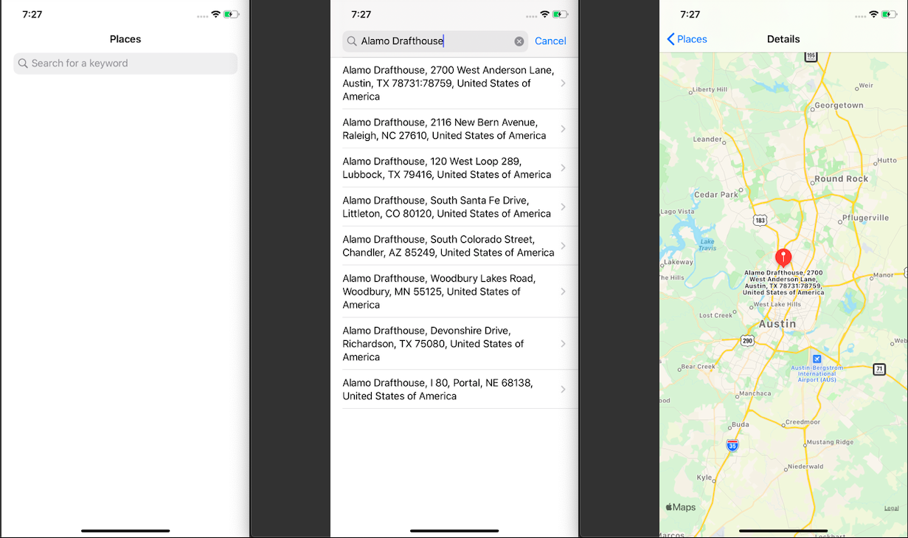
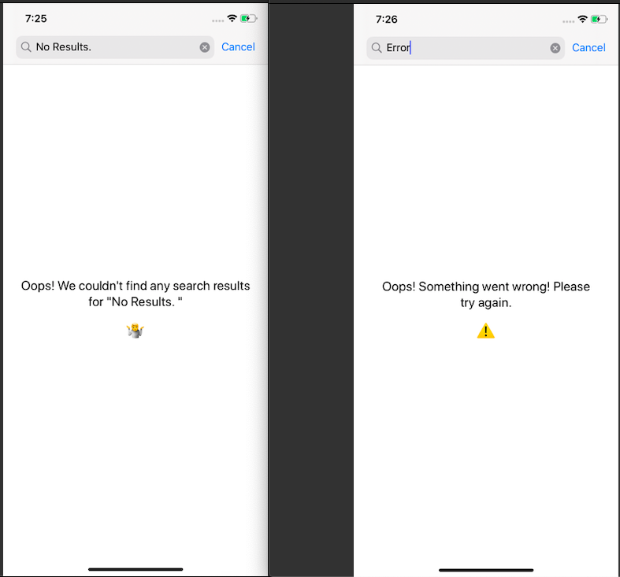
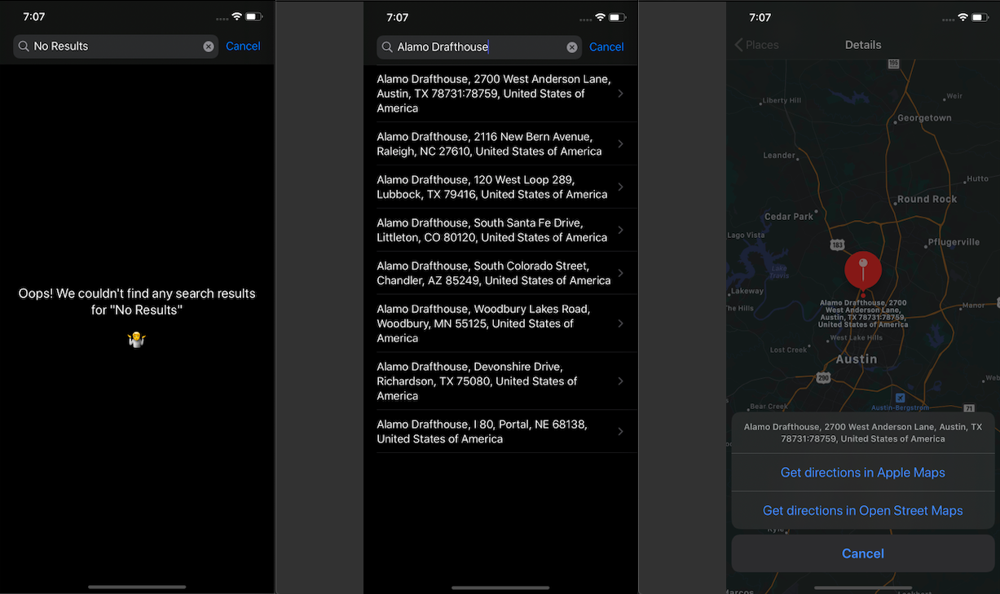
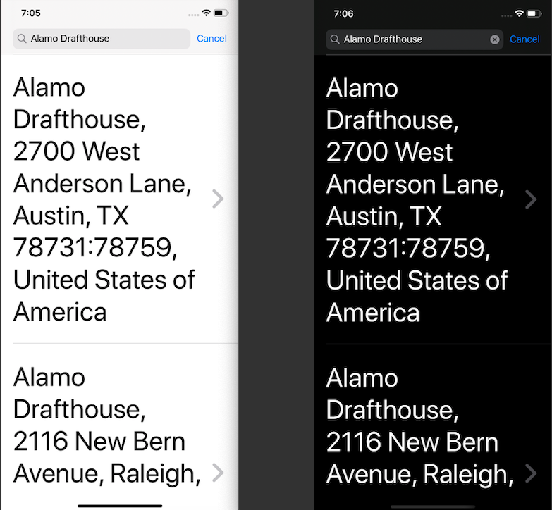
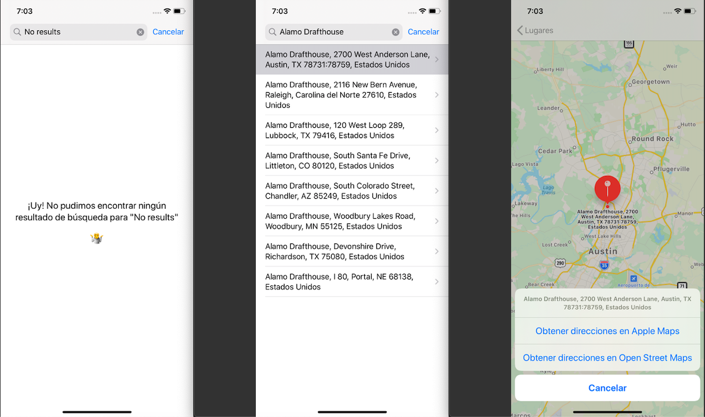

# alamodrafthouse_challenge
Coding Challenge for Alamo Drafthouse

### Requirements:
- Xcode 11.5 or later

### Getting Started:
- Clone the repository
- Open the project
- Select the `alamo_coding_challenge` scheme
- Run (cmd+r)

### Features:
- The `alamo_coding_challenge` application allows users to query and view places for a given keyword by leveraging the OpenCage Geocoding (API)[https://opencagedata.com/api]
- Users can view the places retrieved in a list, view each place on a map, and get directions for a given place using Apple Maps or OpenStreetMap.
- Errors and empty search results from the query are handled appropriately in the UI.

### Additional Functionality:
- Unit tests for `PlacesNetworkingController`. Unit test coverage for this class is roughly 93%.
- Support for Dark Mode

- Support for Dynamic Type

- i18n support for Mexican Spanish (es_MX)

